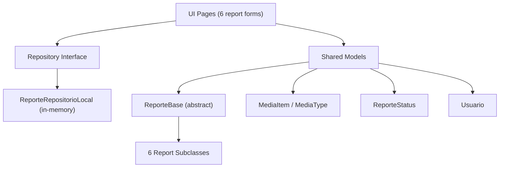

# Data Layer Implementation — Walkthrough

## What was done

Implemented a complete data layer for the App Cidadão project: **14 new files** created, **7 existing files** modified.

### Architecture

---

### New Files Created

#### Core Models (`lib/core/modelos/`)
| File | Purpose |
|---|---|
| [media_item.dart](file:///c:/Users/ResTIC16/Documents/GitHub/appcidadao/lib/core/modelos/media_item.dart) | Shared `MediaType` enum + `MediaItem` class (replaces 6 duplicated definitions) |
| [reporte_status.dart](file:///c:/Users/ResTIC16/Documents/GitHub/appcidadao/lib/core/modelos/reporte_status.dart) | `ReporteStatus` enum: pendente → enviado → emAnalise → resolvido |
| [reporte_base.dart](file:///c:/Users/ResTIC16/Documents/GitHub/appcidadao/lib/core/modelos/reporte_base.dart) | Abstract base class with common fields (id, endereco, descricao, midias, status, dataCriacao) |
| [usuario.dart](file:///c:/Users/ResTIC16/Documents/GitHub/appcidadao/lib/core/modelos/usuario.dart) | Typed `Usuario` model with `copyWith()` and serialization |

#### Report Models (`lib/funcionalidades/home/dados/modelos/`)
| File | Extends ReporteBase with |
|---|---|
| [reporte_interferencia.dart](file:///c:/Users/ResTIC16/Documents/GitHub/appcidadao/lib/funcionalidades/home/dados/modelos/reporte_interferencia.dart) | `tipoInterferencia`, `nomeContato`, `emailContato` |
| [reporte_semaforo.dart](file:///c:/Users/ResTIC16/Documents/GitHub/appcidadao/lib/funcionalidades/home/dados/modelos/reporte_semaforo.dart) | `tipoProblema` |
| [reporte_veiculo.dart](file:///c:/Users/ResTIC16/Documents/GitHub/appcidadao/lib/funcionalidades/home/dados/modelos/reporte_veiculo.dart) | `tipoVeiculo`, `placa`, `marca`, `modelo`, `cor`, `nomeContato`, `telefone`, `email` |
| [reporte_estacionamento.dart](file:///c:/Users/ResTIC16/Documents/GitHub/appcidadao/lib/funcionalidades/home/dados/modelos/reporte_estacionamento.dart) | `tipoInfracao`, `placaVeiculo` |
| [reporte_sinalizacao.dart](file:///c:/Users/ResTIC16/Documents/GitHub/appcidadao/lib/funcionalidades/home/dados/modelos/reporte_sinalizacao.dart) | `tipoSinalizacao` |
| [reporte_iluminacao.dart](file:///c:/Users/ResTIC16/Documents/GitHub/appcidadao/lib/funcionalidades/home/dados/modelos/reporte_iluminacao.dart) | `tipoProblema`, `numeroPoste` |

#### Repository Layer (`lib/core/repositorios/`)
| File | Purpose |
|---|---|
| [reporte_repositorio.dart](file:///c:/Users/ResTIC16/Documents/GitHub/appcidadao/lib/core/repositorios/reporte_repositorio.dart) | Abstract interface: `salvarReporte`, `listarReportes`, `buscarReportePorId`, `atualizarStatus`, `removerReporte` |
| [reporte_repositorio_local.dart](file:///c:/Users/ResTIC16/Documents/GitHub/appcidadao/lib/core/repositorios/reporte_repositorio_local.dart) | Singleton in-memory implementation |
| [usuario_repositorio.dart](file:///c:/Users/ResTIC16/Documents/GitHub/appcidadao/lib/core/repositorios/usuario_repositorio.dart) | Abstract interface: `getUsuarioAtual`, `atualizarUsuario` |
| [usuario_repositorio_local.dart](file:///c:/Users/ResTIC16/Documents/GitHub/appcidadao/lib/core/repositorios/usuario_repositorio_local.dart) | Singleton in-memory implementation with mock user |

---

### Modified Files

All 6 report pages were updated:
- Removed local `MediaType`/`MediaItem` duplicates
- Import shared `media_item.dart` and specific report model
- `_submitReport()` now creates a typed model and saves via `ReporteRepositorioLocal`

| Page | Report Model Used |
|---|---|
| [interferencia_pagina.dart](file:///c:/Users/ResTIC16/Documents/GitHub/appcidadao/lib/funcionalidades/home/apresentacao/paginas/interferencia_pagina.dart) | `ReporteInterferencia` |
| [reporte_semaforo_pagina.dart](file:///c:/Users/ResTIC16/Documents/GitHub/appcidadao/lib/funcionalidades/home/apresentacao/paginas/reporte_semaforo_pagina.dart) | `ReporteSemaforo` |
| [veiculos_quebrado_pagina.dart](file:///c:/Users/ResTIC16/Documents/GitHub/appcidadao/lib/funcionalidades/home/apresentacao/paginas/veiculos_quebrado_pagina.dart) | `ReporteVeiculo` |
| [estacionamento_irregular_pagina.dart](file:///c:/Users/ResTIC16/Documents/GitHub/appcidadao/lib/funcionalidades/home/apresentacao/paginas/estacionamento_irregular_pagina.dart) | `ReporteEstacionamento` |
| [reporte_sinalizacao_pagina.dart](file:///c:/Users/ResTIC16/Documents/GitHub/appcidadao/lib/funcionalidades/home/apresentacao/paginas/reporte_sinalizacao_pagina.dart) | `ReporteSinalizacao` |
| [reporte_iluminacao_pagina.dart](file:///c:/Users/ResTIC16/Documents/GitHub/appcidadao/lib/funcionalidades/home/apresentacao/paginas/reporte_iluminacao_pagina.dart) | `ReporteIluminacao` |

[home_local_datasource.dart](file:///c:/Users/ResTIC16/Documents/GitHub/appcidadao/lib/funcionalidades/home/dados/fonte_dados/home_local_datasource.dart) — replaced `Map<String, dynamic> userData` with typed `Usuario` model + backward-compatible `userData` getter.

---

**Manual import path verification**: ✅ All import paths checked and consistent across all 44 Dart files.

### Recommended next steps
1. Run `flutter analyze` and `flutter build apk --debug`
2. Test all 6 report forms on emulator/device
3. Future: swap `ReporteRepositorioLocal` for SQLite or REST API implementation
