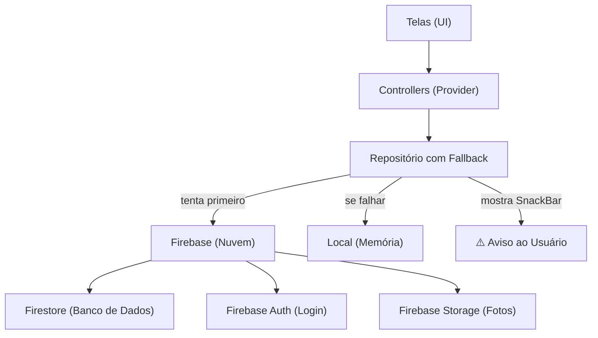

# 🔥 Integração Firebase — App Cidadão

Data: 01/03/2026

---

## O que foi feito

O App Cidadão agora conta com **back-end real** usando o Firebase do Google. Antes, todos os dados (login, reportes, perfil) eram simulados e se perdiam ao fechar o app. Agora:

- ✅ **Login, cadastro e recuperação de senha** funcionam de verdade
- ✅ **Reportes são salvos na nuvem** (persistem mesmo reinstalando o app)
- ✅ **Perfil do usuário** fica armazenado online
- ✅ **Upload de fotos e vídeos** para o Firebase Storage
- ✅ **Se cair a internet**, o app avisa e continua funcionando com dados locais

---

## Arquitetura — Antes vs Depois

```
ANTES (tudo simulado):
  Telas → Controllers → Repositório Local (memória)
  • Login com Future.delayed (fake)
  • Dados perdidos ao fechar o app

DEPOIS (Firebase com fallback):
  Telas → Controllers → Repositório com Fallback
                            ├── tenta Firebase (nuvem) ✅
                            └── se falhar → Repositório Local + aviso ⚠️
  • Login real com Firebase Auth
  • Dados persistem na nuvem
```

### Diagrama



---

## Arquivos Novos (7)

| Arquivo | O que faz |
|---|---|
| [`firebase_options.dart`](file:///c:/Users/ResTIC16/Documents/GitHub/appcidadao/lib/firebase_options.dart) | Configurações do Firebase (placeholder — precisa rodar `flutterfire configure` para gerar o real) |
| [`reporte_repositorio_firebase.dart`](file:///c:/Users/ResTIC16/Documents/GitHub/appcidadao/lib/core/repositorios/reporte_repositorio_firebase.dart) | Salva e lê reportes do Cloud Firestore, filtrados por usuário |
| [`usuario_repositorio_firebase.dart`](file:///c:/Users/ResTIC16/Documents/GitHub/appcidadao/lib/core/repositorios/usuario_repositorio_firebase.dart) | Salva e lê perfil do usuário do Firestore |
| [`reporte_repositorio_com_fallback.dart`](file:///c:/Users/ResTIC16/Documents/GitHub/appcidadao/lib/core/repositorios/reporte_repositorio_com_fallback.dart) | Tenta Firebase → se falhar, usa local e avisa o usuário |
| [`usuario_repositorio_com_fallback.dart`](file:///c:/Users/ResTIC16/Documents/GitHub/appcidadao/lib/core/repositorios/usuario_repositorio_com_fallback.dart) | Tenta Firebase → se falhar, usa local e avisa o usuário |
| [`storage_servico.dart`](file:///c:/Users/ResTIC16/Documents/GitHub/appcidadao/lib/core/servicos/storage_servico.dart) | Upload de fotos e vídeos para o Firebase Storage |
| [`firebase_setup_guia.md`](file:///c:/Users/ResTIC16/Documents/GitHub/appcidadao/docs/firebase_setup_guia.md) | Guia passo-a-passo para configurar o Firebase (ver abaixo) |

## Arquivos Modificados (3)

| Arquivo | O que mudou |
|---|---|
| [`pubspec.yaml`](file:///c:/Users/ResTIC16/Documents/GitHub/appcidadao/pubspec.yaml) | Adicionados: `firebase_core`, `firebase_auth`, `cloud_firestore`, `firebase_storage` |
| [`autenticacao_controller.dart`](file:///c:/Users/ResTIC16/Documents/GitHub/appcidadao/lib/funcionalidades/autenticacao/controladores/autenticacao_controller.dart) | Login/cadastro/recuperar senha agora usam Firebase Auth. Erros traduzidos para português. Fallback offline. |
| [`main.dart`](file:///c:/Users/ResTIC16/Documents/GitHub/appcidadao/lib/main.dart) | Firebase.initializeApp com try/catch. Repositórios injetados com fallback automático. SnackBar global para avisos de conexão. |

---

## Estrutura dos dados no Firestore

### Coleção `reportes`

```json
{
  "id": "uuid-gerado-pelo-app",
  "tipoReporte": "interferencia",
  "endereco": "Rua das Flores, 123",
  "pontoReferencia": "Perto do mercado",
  "descricao": "Buraco grande na calçada",
  "midias": [
    { "url": "https://firebasestorage.../foto.jpg", "type": "image" }
  ],
  "status": "enviado",
  "dataCriacao": "2026-03-01T14:30:00.000",
  "userId": "firebase-auth-uid-do-usuario",
  "tipoInterferencia": "Buraco na Via"
}
```

### Coleção `usuarios`

```json
{
  "nome": "Maria Silva",
  "email": "maria@email.com",
  "conta": "abc1234",
  "avatar": "https://ui-avatars.com/api/?name=Maria+Silva",
  "telefone": "(11) 99999-9999",
  "cpf": "123.456.789-00"
}
```

---

## Como funciona o Fallback Automático

1. O app **tenta conectar ao Firebase** ao iniciar
2. Se o Firebase **não foi configurado** (placeholder) ou **não tem internet**:
   - O app mostra um **aviso na tela** (SnackBar laranja com ícone de Wi-Fi off)
   - Automaticamente **troca para o modo local** (dados em memória)
   - O usuário pode continuar usando o app normalmente
3. Para **voltar ao Firebase**, basta ter internet na próxima vez que abrir o app

---

## Próximos passos

Para o Firebase funcionar de verdade, é preciso **configurar o projeto no Firebase Console**. Veja o guia completo em:

📄 [`docs/firebase_setup_guia.md`](file:///c:/Users/ResTIC16/Documents/GitHub/appcidadao/docs/firebase_setup_guia.md)
