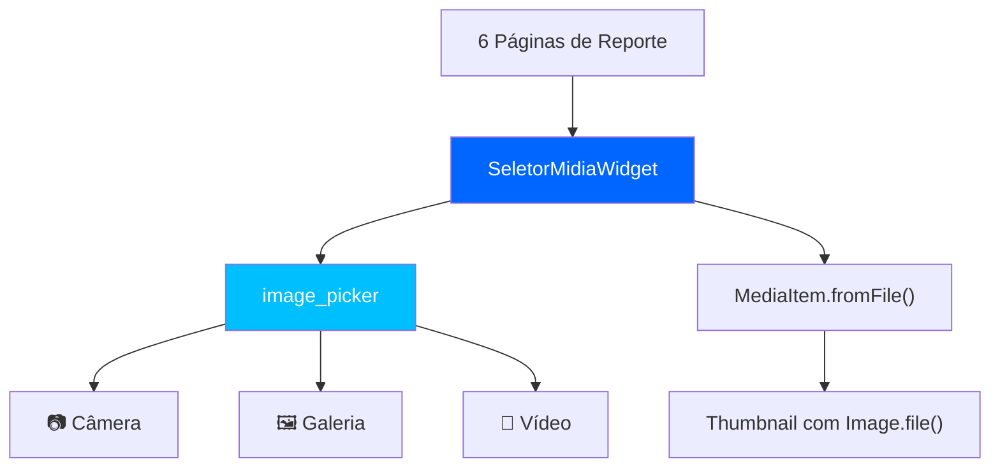

# Upload de Mídia nos Reportes — 
## Resumo

Substituída a lógica placeholder de mídia (URLs hardcoded + ícones genéricos) por **upload real** usando `image_picker`, com um widget reutilizável que exibe thumbnails reais e permite remoção individual.

## Arquitetura



## Arquivos Criados

| Arquivo | Propósito |
|---|---|
| [seletor_midia_widget.dart](file:///c:/Users/ResTIC16/Documents/GitHub/appcidadao/lib/core/widgets/seletor_midia_widget.dart) | Widget reutilizável com 3 botões (Câmera, Galeria, Vídeo), grid de thumbnails, botão de remoção e contador |

## Arquivos Modificados

| Arquivo | Mudança |
|---|---|
| [media_item.dart](file:///c:/Users/ResTIC16/Documents/GitHub/appcidadao/lib/funcionalidades/reportes/dominio/entidades/media_item.dart) | Adicionado `filePath`, `nomeArquivo` e factory `fromFile()` |
| [interferencia_pagina.dart](file:///c:/Users/ResTIC16/Documents/GitHub/appcidadao/lib/funcionalidades/home/apresentacao/paginas/interferencia_pagina.dart) | Substituído `_addMedia()` pelo `SeletorMidiaWidget` |
| [reporte_semaforo_pagina.dart](file:///c:/Users/ResTIC16/Documents/GitHub/appcidadao/lib/funcionalidades/home/apresentacao/paginas/reporte_semaforo_pagina.dart) | Substituído `_addMedia()` pelo `SeletorMidiaWidget` |
| [veiculos_quebrado_pagina.dart](file:///c:/Users/ResTIC16/Documents/GitHub/appcidadao/lib/funcionalidades/home/apresentacao/paginas/veiculos_quebrado_pagina.dart) | Substituído `_addMedia()` pelo `SeletorMidiaWidget` |
| [estacionamento_irregular_pagina.dart](file:///c:/Users/ResTIC16/Documents/GitHub/appcidadao/lib/funcionalidades/home/apresentacao/paginas/estacionamento_irregular_pagina.dart) | Substituído `_addMedia()` pelo `SeletorMidiaWidget` + corrigido import Provider |
| [reporte_sinalizacao_pagina.dart](file:///c:/Users/ResTIC16/Documents/GitHub/appcidadao/lib/funcionalidades/home/apresentacao/paginas/reporte_sinalizacao_pagina.dart) | Substituído `_addMedia()` pelo `SeletorMidiaWidget` |
| [reporte_iluminacao_pagina.dart](file:///c:/Users/ResTIC16/Documents/GitHub/appcidadao/lib/funcionalidades/home/apresentacao/paginas/reporte_iluminacao_pagina.dart) | Substituído `_addMedia()` pelo `SeletorMidiaWidget` |

## O que mudou na UI

### Antes
- 2 botões simples (Foto / Vídeo) que adicionavam URLs fake
- Thumbnails exibiam apenas ícones genéricos (`Icons.image` / `Icons.play_circle`)
- Sem possibilidade de remover uma mídia após adicionada

### Depois
- **3 botões**: Câmera (abre câmera nativa), Galeria (múltipla seleção), Vídeo (com bottom sheet câmera/galeria)
- Thumbnails exibem **preview real** da imagem via `Image.file()`
- **Botão X** para remover mídia individual
- **Contador** visual (ex: `3 / 5`) com limite configurável
- Botões desabilitam automaticamente ao atingir o limite
- **Badge** de tipo (IMG/VID) no canto inferior de cada thumbnail
- Estilização consistente com o tema dark/neon do app

## Como usar o SeletorMidiaWidget em novos formulários

```dart
// 1. Declare a lista de mídias no State
final List<MediaItem> _midias = <MediaItem>[];

// 2. No build(), use o widget:
SeletorMidiaWidget(
  midias: _midias,
  maxItems: 5,  // opcional, padrão: 5
  titulo: 'Fotos do problema',  // opcional
  onChanged: (novaLista) => setState(
    () => _midias
      ..clear()
      ..addAll(novaLista),
  ),
),

// 3. Ao submeter o reporte, passe a lista:
final reporte = MeuReporte(
  midias: List.from(_midias),
  // ...
);
```

## Dependências

O pacote `image_picker: ^1.0.7` usado
