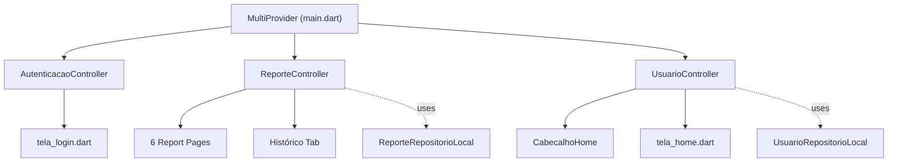

# State Management with Provider — Walkthrough

## Summary

Added **Provider + ChangeNotifier** state management to the App Cidadão project. This replaces direct repository calls and local `setState` patterns with centralized, reactive controllers.

## Architecture

## Changes Made

### New Files (3 controllers)

| File | Responsibility |
|---|---|
| [autenticacao_controller.dart](file:///c:/Users/ResTIC16/Documents/GitHub/appcidadao/lib/funcionalidades/autenticacao/controladores/autenticacao_controller.dart) | Login/logout state, loading indicator, error messages |
| [reporte_controller.dart](file:///c:/Users/ResTIC16/Documents/GitHub/appcidadao/lib/funcionalidades/home/controladores/reporte_controller.dart) | Submit, list, update, remove reports |
| [usuario_controller.dart](file:///c:/Users/ResTIC16/Documents/GitHub/appcidadao/lib/funcionalidades/home/controladores/usuario_controller.dart) | Load and update user profile data |

### Modified Files

| File | Change |
|---|---|
| [pubspec.yaml](file:///c:/Users/ResTIC16/Documents/GitHub/appcidadao/pubspec.yaml) | Added `provider: ^6.1.2` |
| [main.dart](file:///c:/Users/ResTIC16/Documents/GitHub/appcidadao/lib/main.dart) | Wrapped with `MultiProvider` |
| [tela_login.dart](file:///c:/Users/ResTIC16/Documents/GitHub/appcidadao/lib/funcionalidades/autenticacao/apresentacao/paginas/tela_login.dart) | Uses `Consumer<AutenticacaoController>` for login button |
| [tela_home.dart](file:///c:/Users/ResTIC16/Documents/GitHub/appcidadao/lib/funcionalidades/home/apresentacao/paginas/tela_home.dart) | Uses `Consumer<UsuarioController>` + `Consumer<ReporteController>` for Histórico |
| [cabecalho_home_widget.dart](file:///c:/Users/ResTIC16/Documents/GitHub/appcidadao/lib/funcionalidades/home/apresentacao/componentes/cabecalho_home_widget.dart) | Now accepts typed `String` fields instead of `Map` |
| 6 report pages | Replaced `_repositorio.salvarReporte()` → `context.read<ReporteController>().submeterReporte()` |

### Key Feature: Histórico Tab

The placeholder "Histórico" text is now a fully functional tab showing submitted reports with:
- Empty state illustration when no reports exist
- Report cards with type-specific icons, addresses, and status badges
- Auto-refresh when new reports are submitted from any page

